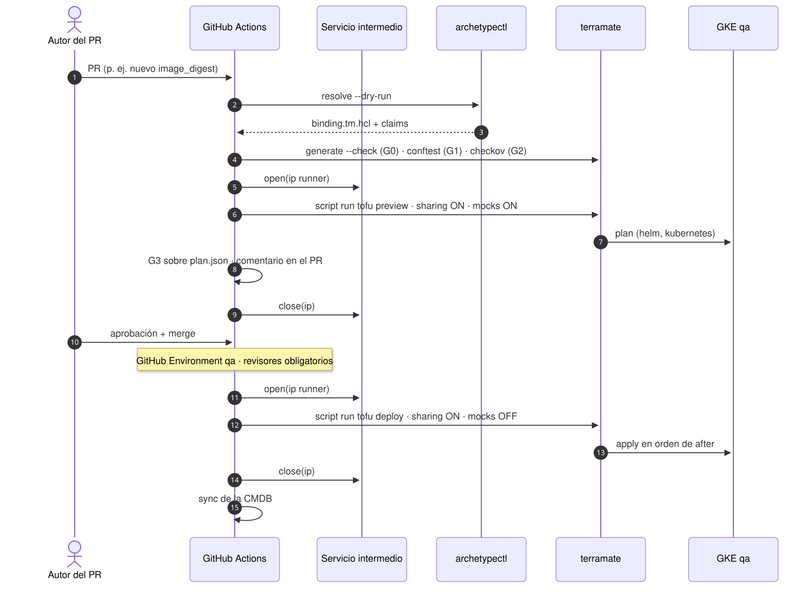
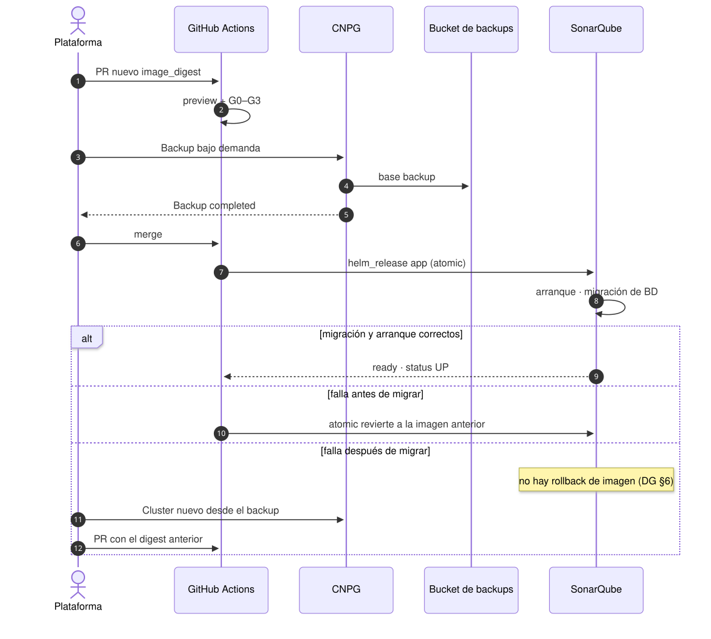
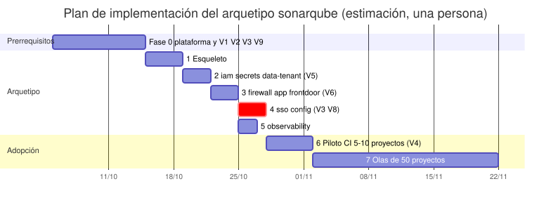

# Arquetipo `sonarqube` (capa 5) — Propuesta y plan de implementación

| | |
|---|---|
| **Estado** | Propuesta · etapa 2 · revisión 1 |
| **Parte de** | [`README.md`](README.md) (etapa 1: elementos y dependencias, cerrada) |
| **Alcance** | El arquetipo de capa 5 `sonarqube`: estructura en el repositorio, manifiesto, los stacks que lo forman, la plantilla (generador) de cada stack, contratos, ejecución, configuración, políticas, lo que provee y el plan de implementación por fases |
| **Fuera de alcance** | Las capas 0–4 de `qa` (son de la plataforma; aquí solo aparecen como productores y como requisitos) |
| **Especificación de referencia** | Arquitectura (§n), modelo de arquetipos (AM §n), guía del desarrollador (DG §n), etapa 1 (E1 §n) |
| **Diagramas** | `diagrams/11-*` a `diagrams/19-*` (`.mmd` fuente, `.svg` renderizado) |

Los bloques HCL y YAML de este documento son **plantillas de diseño**: fijan la forma, los nombres y los contratos. Las claves exactas del chart oficial de SonarQube y de los proveedores se verifican contra las versiones fijadas antes de escribir código; donde hay duda se marca **(verificar)**.

---

## 1. Resumen

| Aspecto | Decisión |
|---|---|
| Arquetipo | `sonarqube`, `kind: catalog`, **capa 5**, versión inicial `0.1.0` |
| Instancia | `sonarqube-main` en `qa` (GCP, `disasterproject-qa`, `europe-west1`, modelo dedicado) |
| Stacks | **9**: `iam`, `secrets`, `data-tenant`, `firewall`, `sso`, `app`, `config`, `frontdoor`, `observability` |
| Provee | **Ninguna capability**. Publica salidas para la CMDB (URL, versión, digest). Su consumidor son pipelines por HTTP, no stacks |
| Consume | `cluster`, `policy`, `ingress`, `secrets`, `oidc-idp`, `database-platform`, `monitoring` |
| Estado persistente | PostgreSQL (CNPG, dedicado) + clave de cifrado de settings en Secret Manager. Nada más |
| Principio | La lógica específica de SonarQube vive en el **chart del arquetipo** y en sus valores. Los generadores son genéricos por capacidad (§4.7); solo cambian las ramas por cloud |

### Cambios respecto a la etapa 1

| Cambio | Motivo |
|---|---|
| El bucket de backups de PostgreSQL lo crea el **propio arquetipo** (stack `data-tenant`); `object-store` deja de ser una dependencia | AM §5.1: un arquetipo aporta su propio almacén de datos, y destruirlo destruye su almacén. Un bucket de plataforma compartido obligaría a condiciones IAM por prefijo, frágiles con `objects.list` |
| `sso` pasa a ir **antes** de `app` | La URL de SonarQube es determinista (claim de hostname), así que el cliente SAML puede existir antes que la aplicación. El primer login funciona en cuanto `app` arranca |
| Nuevo stack `config` | Grupos, plantillas de permisos y quality gate como código. SonarQube guarda esa configuración en BD y no tiene configuración declarativa nativa |
| El límite de cuerpo de petición deja de ser un recurso del arquetipo | En Envoy Gateway ese límite es una `ClientTrafficPolicy` que se asocia al **Gateway**, que es de la plataforma. Pasa a ser un requisito al arquetipo `gateway` (§9) |

---

## 2. Estructura en el repositorio

```
archetypes/sonarqube/                        # definición del arquetipo (versionada)
├── manifest.yaml                            # §3 — fuente única: requires, stacks, claims, capacity
├── README.md
├── chart/                                   # chart "envoltorio" del arquetipo
│   ├── Chart.yaml                           # dependencia: sonarqube/sonarqube (versión fijada)
│   ├── values.yaml                          # valores por defecto seguros (§6.1)
│   └── templates/
│       ├── networkpolicies.yaml             # stack firewall
│       ├── secretstore.yaml                 # stack secrets
│       ├── externalsecrets.yaml             # stack secrets
│       ├── cnpg-cluster.yaml                # stack data-tenant
│       ├── httproute.yaml                   # stack frontdoor
│       ├── backendtrafficpolicy.yaml        # stack frontdoor
│       ├── podmonitor.yaml                  # stack observability
│       ├── prometheusrule.yaml              # stack observability
│       ├── probe.yaml                       # stack observability (blackbox)
│       ├── dashboard-configmap.yaml         # stack observability
│       └── config-job.yaml                  # stack config
├── config/                                  # configuración de SonarQube como código (§6.3)
│   ├── teams.yaml                           # equipos → grupo, prefijo de proyecto
│   └── quality-gate.yaml
└── image/
    └── Dockerfile                           # FROM sonarqube:<v>-community + plugins (E1 §4.10)

stacks/archetypes/sonarqube/
├── archetype.tm.hcl                         # globals comunes del arquetipo (§4.2)
└── instances/main/
    ├── binding.tm.hcl                       # ESCRITO POR EL RESOLVER — nunca a mano
    ├── instance.tm.hcl                      # overrides de la instancia (a mano, revisado)
    ├── iam/            stack.tm.hcl
    ├── secrets/        stack.tm.hcl
    ├── data-tenant/    stack.tm.hcl
    ├── firewall/       stack.tm.hcl
    ├── sso/            stack.tm.hcl
    ├── app/            stack.tm.hcl
    ├── config/         stack.tm.hcl
    ├── frontdoor/      stack.tm.hcl
    └── observability/  stack.tm.hcl

imports/
├── generators/v1/
│   ├── gen_tenant_namespace.tm.hcl          # iam: namespace + KSAs (genérico)
│   ├── gen_secrets.tm.hcl                   # secrets: Secret Manager + ESO (genérico, rama GCP)
│   ├── gen_data_tenant_cnpg.tm.hcl          # data-tenant: bucket + IAM + Cluster CNPG
│   ├── gen_helm_stack.tm.hcl                # firewall, sso, frontdoor, observability, config
│   └── gen_app.tm.hcl                       # app (ya existe en el diseño; rama helm_release)
└── contracts/
    ├── contract_app_gcp.tm.hcl              # existente: cluster_endpoint, cluster_ca, workload_identity_pool
    ├── contract_oidc_idp_saml.tm.hcl        # NUEVO: entradas SAML desde keycloak
    └── contract_database_platform.tm.hcl    # NUEVO: versión del operador CNPG
```

| Regla | Por qué |
|---|---|
| Un solo chart del arquetipo, desplegado como **varios `helm_release`** (uno por stack) con `values` que activan solo su parte | Una versión del chart, un sitio para revisar plantillas, y a la vez cada stack con su propio ciclo de vida: cambiar una alerta no redespliega SonarQube |
| Ningún recurso con CRD se crea con `kubernetes_manifest` | CRD y API server necesarios en plan; rompe las previsualizaciones (R24). Todo CR va en el chart |
| `binding.tm.hcl` lo escribe el resolver; `instance.tm.hcl` es el único fichero de instancia editado a mano | Lo que decide la plataforma y lo que decide el equipo quedan separados y revisables |

### 2.1 De las fuentes al código generado



Fuente: [`diagrams/13-generacion.mmd`](diagrams/13-generacion.mmd)

Lo único que se edita a mano son las fuentes de la izquierda. Todo lo de la derecha lo producen el resolver y `terramate generate`, se commitea, y G0 falla si alguien lo toca a mano.

### 2.2 Un chart, varios releases



Fuente: [`diagrams/14-chart-releases.mmd`](diagrams/14-chart-releases.mmd)

---

## 3. Manifiesto

Sustituye al borrador de E1 §7 (que queda como histórico).

```yaml
apiVersion: archetype/v1
kind: Archetype

metadata:
  name: sonarqube
  version: 0.1.0
  layer: 5
  kind: catalog
  description: SonarQube Community Build, single node, SAML contra oidc-idp, PostgreSQL dedicado
  owners: [team-platform]

runtimes: [gke, eks, aks]                          # gke-autopilot excluido por el trait de cluster

requires:
  - capability: cluster
    version: "^2.0.0"
    traits: [sysctl-max-map-count]
  - capability: policy
    version: "^1.0.0"
  - capability: ingress
    version: ">=3.0.0 <4.0.0"
    traits: [gateway-api, http-route]
  - capability: secrets
    version: "^2.0.0"
  - capability: oidc-idp
    version: "^4.2.0"                              # 4.2 añade las salidas SAML (§5.5)
    traits: [saml-idp]
  - capability: database-platform
    version: "^1.0.0"
    traits: [cnpg]
  - capability: monitoring
    version: "^1.5.0"
    traits: [prometheus-operator-crds]

conflicts:
  - capability: legacy-ingress

stacks:
  - name: iam
  - name: secrets
    after: [iam]
  - name: data-tenant
    after: [iam, secrets]
    creates_tenant_resources: [database-platform]
  - name: firewall
    after: [data-tenant]
  - name: sso
    after: [iam]
    creates_tenant_resources: [oidc-idp]
  - name: app
    after: [secrets, firewall, sso]
  - name: config
    after: [app]
  - name: frontdoor
    after: [app]
  - name: observability
    after: [app]

claims:
  - kind: hostname
    pool: "{{ environment.dns_zone }}"
    value: "sonar.{{ environment.dns_suffix }}"

firewall:
  - name: gateway-to-sonar
    from: zone:pods
    to: self
    ports: [9000]

capacity:
  cpu_millicores: 8000
  memory_mib: 28672
  pvc_gib: 250
  ingress_routes: 1
  workload_identities: 2

providers:
  - source: hashicorp/google
    version: "~> 6.0"                              # write-only secret_data_wo: versión mínima a fijar (V9)
    runtimes: [gke]
  - source: hashicorp/kubernetes
    version: ">= 2.30, < 3.0"
  - source: hashicorp/helm
    version: "~> 2.14"
```

Valida contra `schemas/archetype-manifest.schema.json` con los traits ya registrados.

---

## 4. Globals: qué viene de dónde

### 4.1 `binding.tm.hcl` — lo escribe el resolver

```hcl
# stacks/archetypes/sonarqube/instances/main/binding.tm.hcl — GENERATED by archetypectl resolve
globals "platform" {
  cloud      = "gcp"
  env        = "qa"
  model      = "dedicated"
  project_id = "disasterproject-qa"
  region     = "europe-west1"
  namespace  = "sonarqube"

  # producers, one per capability (AM §7)
  cluster_stack_id           = "gcp-qa-gke"
  policy_stack_id            = "gcp-qa-policy"
  gateway_stack_id           = "gcp-qa-gateway"
  secrets_stack_id           = "gcp-qa-secrets"
  keycloak_stack_id          = "gcp-qa-keycloak"
  postgres_operator_stack_id = "gcp-qa-postgres-operator"
  monitoring_stack_id        = "gcp-qa-monitoring"

  # deterministic facts of the producers (globals, not sharing — platform-overview §4)
  gateway_name       = "qa"
  gateway_namespace  = "envoy-gateway-system"
  keycloak_realm     = "qa"
  keycloak_namespace = "keycloak"
  rules_selector     = { "prometheus" = "qa" }
}

globals "claims" {
  hostname = "sonar.qa.disasterproject.com"
}

globals {
  archetype = "sonarqube"
  archetype_version = "0.1.0"
  instance  = "sonarqube-main"
}
```

### 4.2 `archetype.tm.hcl` — valores por defecto del arquetipo

```hcl
# stacks/archetypes/sonarqube/archetype.tm.hcl
globals "sonarqube" {
  chart_version  = "0.1.0"                  # chart del arquetipo
  image          = "europe-docker.pkg.dev/disasterproject-lz/platform/sonarqube"
  image_digest   = ""                        # obligatorio por instancia (assert §7.1)

  heap_web_mib    = 2048
  heap_ce_mib     = 3072
  heap_search_mib = 3072
  non_heap_mib    = 1536                     # 3 × ~512 MiB (DG §8.3)
  memory_limit_mib = 12288
  cpu_request_m    = 4000

  es_pvc_gib      = 50
  storage_class   = "hyperdisk-balanced"

  db_instances    = 2
  db_storage_gib  = 100
  db_cpu_m        = 2000
  db_memory_mib   = 8192
  backup_retention_days = 14                 # §12.6, columna qa

  node_pool       = "sonar"
}
```

### 4.3 `instance.tm.hcl` — decisiones de la instancia

```hcl
# stacks/archetypes/sonarqube/instances/main/instance.tm.hcl
globals "sonarqube" {
  image_digest = "sha256:<digest promovido>"   # nunca un tag (DG §5.2)
}
```

Un cambio de versión de SonarQube es un PR que cambia **solo** esta línea (y, si procede, la versión del chart). Eso lo hace revisable y trazable.

---

## 5. Los stacks, uno a uno



Fuente: [`diagrams/11-stacks-arquetipo.mmd`](diagrams/11-stacks-arquetipo.mmd)

Todos los stacks comparten:

```hcl
# patrón común de stack.tm.hcl (ejemplo: app)
stack {
  id    = "gcp-qa-sonarqube-main-app"
  name  = "qa — sonarqube-main — app"
  tags  = ["gcp", "qa", "app", "archetype:sonarqube", "instance:sonarqube-main", "consumer"]
  after = [
    "/stacks/archetypes/sonarqube/instances/main/secrets",
    "/stacks/archetypes/sonarqube/instances/main/firewall",
    "/stacks/archetypes/sonarqube/instances/main/sso",
    "/stacks/platforms/gcp/qa/gke",                          # productor por sharing → after (R2)
    "/stacks/platforms/gcp/qa/keycloak",
  ]
}

globals { capability = "app" }

import { source = "/imports/mixins/backend_gcp.tm.hcl" }
import { source = "/imports/mixins/provider_gcp.tm.hcl" }
import { source = "/imports/mixins/provider_k8s_gke.tm.hcl" }   # kubernetes + helm, token local (nunca compartido)
import { source = "/imports/mixins/labels.tm.hcl" }
import { source = "/imports/contracts/contract_app_gcp.tm.hcl" }
import { source = "/imports/contracts/contract_oidc_idp_saml.tm.hcl" }
import { source = "/imports/generators/v1/gen_app.tm.hcl" }
```

| Regla común | Aplicación |
|---|---|
| Cada `input` tiene su `after` al stack productor | G1 lo comprueba (R2). La tabla de entradas de cada stack de abajo es la lista que G1 compara |
| Cada `input` tiene `mock` con tipo correcto y prefijo `mock-` | Previsualización en PR (§4.4 arquitectura) |
| El token del cluster se obtiene localmente (`google_client_config`) | Nunca por sharing |
| Etiquetas obligatorias de `registry/labels.yaml` en namespace, workloads y recursos GCP | Las emite `labels.tm.hcl`; Gatekeeper las valida (sin mutación) |

### 5.1 `iam` — namespace e identidades

| | |
|---|---|
| **Propósito** | Namespace de la instancia y las cuentas de servicio de Kubernetes. Es el primer stack: todo lo demás vive dentro |
| **Generador** | `gen_tenant_namespace.tm.hcl` (genérico, cloud-agnóstico salvo la anotación de identidad) |
| **Recursos** | `kubernetes_namespace` `sonarqube` (etiquetas `archetype`, `instance`, `pod-security.kubernetes.io/enforce: restricted`); KSA `sonarqube`, `eso-sonarqube`, `sonarqube-db`; `LimitRange` por defecto |
| **No crea** | Cuentas de servicio GCP. Con Workload Identity directa se concede IAM al principal del KSA en el recurso que lo necesita, en el stack que crea ese recurso |
| **Entradas** | `cluster_endpoint`, `cluster_ca` (de `gcp-qa-gke`) |
| **Salidas (CMDB)** | `namespace` |

```hcl
# imports/generators/v1/gen_tenant_namespace.tm.hcl (extracto)
generate_hcl "_namespace.tf" {
  condition = global.capability == "iam"
  content {
    resource "kubernetes_namespace_v1" "this" {
      metadata {
        name   = global.platform.namespace
        labels = merge(global.labels.namespace, {
          "pod-security.kubernetes.io/enforce" = "restricted"
        })
      }
    }
    resource "kubernetes_service_account_v1" "ksa" {
      for_each = toset(global.tenant.service_accounts)   # ["sonarqube", "eso-sonarqube", "sonarqube-db"]
      metadata {
        name      = each.key
        namespace = kubernetes_namespace_v1.this.metadata[0].name
        labels    = global.labels.workload_base
      }
      automount_service_account_token = each.key == "eso-sonarqube"
    }
  }
}
```

`automount_service_account_token` solo en el KSA de ESO: SonarQube no habla con la API de Kubernetes y no debe tener token montado.

### 5.2 `secrets` — Secret Manager y External Secrets

| | |
|---|---|
| **Propósito** | Contenedores de secreto en Secret Manager, su IAM y su materialización en el namespace (E1 §4.3) |
| **Generador** | `gen_secrets.tm.hcl`, rama GCP |
| **Recursos GCP** | 5 × `google_secret_manager_secret` (`qa-sonarqube-db`, `-passcode`, `-admin`, `-secret-key`, `-saml-sp`), replicación user-managed `europe-west1`, `version_destroy_ttl = 2592000s`; versiones iniciales con `ephemeral "random_password"` + `secret_data_wo` (V9); `google_secret_manager_secret_iam_member` `secretAccessor` **por secreto** al principal de `eso-sonarqube` |
| **Recursos K8s** | `helm_release` del chart del arquetipo con `secrets.enabled=true`: `SecretStore` (namespaced, auth Workload Identity) y 5 `ExternalSecret` |
| **Protección** | `lifecycle { prevent_destroy = true }` en `qa-sonarqube-secret-key` |
| **Entradas** | `cluster_*`, `workload_identity_pool` (de `gcp-qa-gke`) |
| **Salidas** | `secret_ids` (**nombres**, no valores) — para la CMDB |

```hcl
# imports/generators/v1/gen_secrets.tm.hcl (rama GCP, extracto)
generate_hcl "_secrets.tf" {
  condition = global.capability == "secrets" && global.platform.cloud == "gcp"
  content {
    locals {
      eso_principal = "principal://iam.googleapis.com/projects/${data.google_project.this.number}/locations/global/workloadIdentityPools/${var.workload_identity_pool}/subject/ns/${global.platform.namespace}/sa/eso-${global.archetype}"
    }

    resource "google_secret_manager_secret" "this" {
      for_each  = global.tenant.secrets            # mapa nombre → { generate = bool, length = n }
      project   = global.platform.project_id
      secret_id = "${global.platform.env}-${global.archetype}-${each.key}"
      labels    = global.labels.cloud_resource
      version_destroy_ttl = "2592000s"
      replication {
        user_managed { replicas { location = global.platform.region } }
      }
    }

    ephemeral "random_password" "gen" {
      for_each = { for k, v in global.tenant.secrets : k => v if v.generate }
      length   = each.value.length
      special  = false
    }

    resource "google_secret_manager_secret_version" "initial" {
      for_each               = ephemeral.random_password.gen
      secret                 = google_secret_manager_secret.this[each.key].id
      secret_data_wo         = each.value.result          # nunca entra en el estado (R40)
      secret_data_wo_version = 1
    }

    resource "google_secret_manager_secret_iam_member" "eso" {
      for_each  = google_secret_manager_secret.this
      secret_id = each.value.id
      role      = "roles/secretmanager.secretAccessor"
      member    = local.eso_principal
    }
  }
}
```

`qa-sonarqube-saml-sp` (clave y certificado del SP si se firman las peticiones SAML) y la parte "usuario" de `qa-sonarqube-db` no son contraseñas aleatorias: el primero se genera con un script de arranque de una vez, el segundo es un valor fijo (`sonarqube`) que se escribe igual. `generate = false` en el mapa.

### 5.3 `data-tenant` — PostgreSQL dedicado con CloudNativePG

| | |
|---|---|
| **Propósito** | Instancia PostgreSQL propia, sus backups y su bucket |
| **Generador** | `gen_data_tenant_cnpg.tm.hcl`: rama GCP para bucket e IAM, parte común para el `helm_release` |
| **Recursos GCP** | `google_storage_bucket` `disasterproject-qa-sonarqube-main-pgbackup` (regional, `uniform_bucket_level_access`, `public_access_prevention = "enforced"`, **sin** versionado ni retention lock — E1 §4.9, soft delete 7 días); `google_storage_bucket_iam_member` `objectAdmin` al principal de `sonarqube-db` |
| **Recursos K8s** | `helm_release` con `database.enabled=true`: `Cluster` CNPG `sonarqube-db` (2 instancias, anti-afinidad por nodo, `bootstrap.initdb` con `secret: sonarqube-db`), backups con el plugin barman-cloud (`ObjectStore` + `ScheduledBackup` diario) **(verificar: API del plugin en la versión de CNPG fijada)** |
| **Tenant resource** | `Cluster`, `ScheduledBackup` en el propio namespace — requiere que `postgres-operator` los autorice (E1 §4.4) |
| **Entradas** | `cluster_*`, `workload_identity_pool` (gke); `cnpg_version` (de `gcp-qa-postgres-operator`) |
| **Salidas** | `db_rw_service` = `sonarqube-db-rw.sonarqube.svc` · `db_name` = `sonarqube` · `backup_bucket` |

`cnpg_version` entra por sharing para que un `assert` compare la API que usa el chart con la del operador instalado: un chart del arquetipo escrito para una API más nueva que el operador falla en `generate`, no en el apply.

```yaml
# chart/templates/cnpg-cluster.yaml (extracto de valores efectivos)
apiVersion: postgresql.cnpg.io/v1
kind: Cluster
metadata: { name: sonarqube-db }
spec:
  instances: 2
  imageName: ghcr.io/cloudnative-pg/postgresql:<mayor soportada por SonarQube>   # verificar
  storage: { size: 100Gi, storageClass: hyperdisk-balanced }
  resources: { requests: { cpu: "2", memory: 8Gi }, limits: { memory: 8Gi } }
  postgresql:
    parameters:
      max_connections: "200"
      shared_buffers: "2GB"
  bootstrap:
    initdb: { database: sonarqube, owner: sonarqube, secret: { name: sonarqube-db } }
  serviceAccountTemplate:
    metadata: { name: sonarqube-db }
  affinity: { enablePodAntiAffinity: true, topologyKey: kubernetes.io/hostname }
  monitoring: { enablePodMonitor: true }
```



Fuente: [`diagrams/15-datos-backup.mmd`](diagrams/15-datos-backup.mmd)

### 5.4 `firewall` — NetworkPolicies

| | |
|---|---|
| **Propósito** | Default-deny de entrada y salida y las excepciones de E1 §4.8 |
| **Generador** | `gen_helm_stack.tm.hcl` con `firewall.enabled=true` |
| **Recursos** | `NetworkPolicy` × 7: default-deny; Envoy → 9000; Prometheus → 9000 y 9187; SonarQube → CNPG 5432; CNPG ↔ CNPG; operador CNPG → 8000; DNS; CNPG → Private Google Access 443 |
| **Selectores** | Por etiqueta de pod y de namespace, nunca por CIDR, salvo el egress a `199.36.153.8/30` (`private.googleapis.com`) **(verificar)** |
| **Por qué después de `data-tenant`** | Los selectores de CNPG (`cnpg.io/cluster=sonarqube-db`) existen cuando existe el `Cluster`; aplicar antes no falla, pero el orden deja claro qué protege a qué |

### 5.5 `sso` — cliente SAML en Keycloak

| | |
|---|---|
| **Propósito** | Registrar SonarQube como cliente SAML del realm `qa` y mapear roles de Entra ID → grupos |
| **Tenant resource** | `KeycloakClient` en el namespace de Keycloak (`creates_tenant_resources: [oidc-idp]`) |
| **Implementación propuesta** | El arquetipo `keycloak` reconcilia clientes con **keycloak-config-cli** a partir de `ConfigMap` etiquetados `keycloak.disasterproject.com/realm=qa` en su namespace. Este stack crea ese `ConfigMap` con el JSON del cliente |
| **Por qué no el proveedor de OpenTofu de Keycloak** | Necesita credenciales de administración de Keycloak en el pipeline: el pipeline leería un secreto, que es justo lo que E1 §4.3 prohíbe |
| **Contenido del cliente** | `clientId: https://sonar.qa.disasterproject.com` · protocolo `saml` · ACS `https://sonar.qa.disasterproject.com/oauth2/callback/saml` · firma de aserciones · mappers `login`, `name`, `email`, `groups` (grupos de Keycloak, que vienen de los app roles de Entra, E1 §4.6) |
| **Entradas** | `cluster_*` (gke) |
| **Requisito al arquetipo `keycloak`** | Reconciliador de `ConfigMap` y **nuevas salidas** `saml_sso_url` y `saml_idp_certificate` (certificado público, se puede compartir): MINOR del contrato `oidc-idp` → 4.2.0 (AM §4.5) |

Divergencia a resolver en el diseño de `keycloak`: AM §10.4 nombra el tenant resource como el CRD `KeycloakClient`, que era del operador antiguo. El Keycloak Operator actual solo importa realms completos (`KeycloakRealmImport`), sin reconciliar cambios. La propuesta mantiene el **nombre lógico** `KeycloakClient` y cambia la implementación a `ConfigMap` + keycloak-config-cli. Gatekeeper restringe en el namespace de Keycloak qué `ConfigMap` puede crear cada tenant (prefijo `client-<instance>-`), porque RBAC no filtra por nombre.

### 5.6 `app` — SonarQube

| | |
|---|---|
| **Propósito** | El `helm_release` de SonarQube |
| **Generador** | `gen_app.tm.hcl`, rama `helm_release` del chart del arquetipo con `app.enabled=true` (subchart oficial) |
| **Entradas** | `cluster_*` (gke) · `saml_sso_url`, `saml_idp_certificate` (keycloak) |
| **Valores** | §6.1, generados desde globals — nunca un `values.yaml` por instancia editado a mano |
| **Salidas (CMDB)** | `url`, `image_digest`, `chart_version`, `helm_revision` |

```hcl
# imports/generators/v1/gen_app.tm.hcl (rama helm del arquetipo, extracto)
generate_hcl "_app.tf" {
  condition = global.capability == "app" && tm_can(global.sonarqube)
  content {
    resource "helm_release" "app" {
      name       = global.archetype
      namespace  = global.platform.namespace
      chart      = "${terramate.stack.path.to_root}/archetypes/${global.archetype}/chart"
      version    = global.sonarqube.chart_version
      atomic     = true
      wait       = true
      timeout    = 900                  # arranque + migración de BD en upgrades
      values     = [tm_yamlencode(global.sonarqube_values)]   # §6.1

      set {
        name  = "sonarqube.sonarProperties.sonar\\.auth\\.saml\\.certificate\\.secured"
        value = var.saml_idp_certificate            # público; no es un secreto
      }
      set {
        name  = "sonarqube.sonarProperties.sonar\\.auth\\.saml\\.loginUrl"
        value = var.saml_sso_url
      }
    }
  }
}
```

`atomic = true` hace que un despliegue fallido se revierta **salvo** una migración de BD ya ejecutada, que no tiene vuelta atrás (DG §6). Por eso un cambio de versión exige backup verificado antes (§8.3).

### 5.7 `config` — configuración de SonarQube como código

| | |
|---|---|
| **Propósito** | Grupos, plantillas de permisos por equipo, quality gate por defecto, ajustes globales que viven en BD |
| **Mecanismo** | `Job` de Kubernetes (no hook de Helm, DG §7) cuyo nombre incluye el hash de `config/*.yaml`: un cambio de configuración crea un Job nuevo; sin cambios, no se ejecuta nada |
| **Qué hace el Job** | Llama a la Web API con el token de un usuario técnico `platform-config` (en Secret Manager) y aplica de forma idempotente `teams.yaml` y `quality-gate.yaml` |
| **Por qué hace falta** | La sincronización de grupos por SAML solo asigna grupos **que ya existen** en SonarQube. Sin este stack, un equipo nuevo en Entra ID no obtiene permisos |

```yaml
# archetypes/sonarqube/config/teams.yaml
teams:
  - name: payments           # grupo team-payments (app role en Entra ID, E1 §4.6)
    project_prefix: payments_
    permissions: [user, codeviewer, issueadmin, securityhotspotadmin, scan]
  - name: identity
    project_prefix: identity_
    permissions: [user, codeviewer, issueadmin, securityhotspotadmin, scan]
```



Fuente: [`diagrams/16-identidad-permisos.mmd`](diagrams/16-identidad-permisos.mmd)

Alta de un equipo = app role en Entra ID (equipo de identidad) + una entrada en `teams.yaml` (PR a este repositorio). Nada manual en la UI.

### 5.8 `frontdoor` — ruta HTTP

| | |
|---|---|
| **Recursos** | `HTTPRoute` `sonarqube` (host `sonar.qa.disasterproject.com`, `parentRefs` al Gateway `qa`); `BackendTrafficPolicy` asociada a la ruta: timeout de petición 120 s |
| **Lo que no lleva** | **`SecurityPolicy`** (E1 §4.6, R44) — lo impone un `assert` (§7.1) |
| **Entradas** | Ninguna por sharing: nombre y namespace del Gateway son globals |
| **Después de `app`** | La ruta apunta a un Service que existe |

### 5.9 `observability`

| | |
|---|---|
| **Recursos** | `PodMonitor` de SonarQube (cabecera `X-Sonar-Passcode` desde el Secret `sonarqube-passcode`); `PrometheusRule` con las alertas de E1 §4.7; `Probe` del blackbox exporter contra `https://sonar.qa.disasterproject.com/api/system/status`; `ConfigMap` de dashboard con la etiqueta que recoge el sidecar de Grafana |
| **Entradas** | Ninguna por sharing: `rules_selector` es global |
| **Alertas del arquetipo** | Disponibilidad, cola del CE, tareas fallidas, heap, OOMKilled, PVC, retraso de réplica, último backup > 26 h, `ExternalSecret` sin sincronizar |

### 5.10 Tabla de entradas por sharing (lo que G1 compara con `after`)

| Stack | `input` | Productor | Mock |
|---|---|---|---|
| todos los que usan Kubernetes | `cluster_endpoint` | `gcp-qa-gke` | `mock-endpoint.example.invalid` (sin esquema: GKE) |
| todos los que usan Kubernetes | `cluster_ca` (sensitive) | `gcp-qa-gke` | `bW9jaw==` |
| `secrets`, `data-tenant` | `workload_identity_pool` | `gcp-qa-gke` | `mock-project.svc.id.goog` |
| `data-tenant` | `cnpg_version` | `gcp-qa-postgres-operator` | `"0.0.0"`, que el assert trata como desconocido en preview |
| `app` | `saml_sso_url` | `gcp-qa-keycloak` | `https://mock-idp.example.invalid/realms/mock/protocol/saml` |
| `app` | `saml_idp_certificate` | `gcp-qa-keycloak` | certificado PEM de prueba válido, CN `mock-idp` |

El mock de `cnpg_version` rompe la regla del prefijo `mock-` a propósito: el valor debe ser un semver parseable. Queda anotado como excepción en el contrato.

---

## 6. Configuración propuesta

### 6.1 Valores del chart de SonarQube

Claves del chart oficial `sonarqube/sonarqube` **(verificar contra la versión fijada)**. En el repositorio no existe como fichero: es `globals "sonarqube_values"` en `archetype.tm.hcl`, construido a partir de `globals "sonarqube"` (§4.2) y de los claims, y el generador lo serializa con `tm_yamlencode`. Así los asserts de §7.1 ven exactamente lo que se despliega:

```yaml
sonarqube:
  community: { enabled: true }
  image:
    repository: europe-docker.pkg.dev/disasterproject-lz/platform/sonarqube
    tag: "@sha256:<digest>"                     # por digest
  replicaCount: 1
  nodeSelector: { cloud.google.com/gke-nodepool: sonar }
  tolerations: [{ key: dedicated, value: sonar, effect: NoSchedule }]

  initSysctl: { enabled: false }                # sysctl de nodo (E1 §4.1) — assert §7.1
  initFs: { enabled: false }
  securityContext: { fsGroup: 1000, runAsNonRoot: true, seccompProfile: { type: RuntimeDefault } }
  containerSecurityContext:
    runAsUser: 1000
    allowPrivilegeEscalation: false
    capabilities: { drop: [ALL] }
    readOnlyRootFilesystem: true                # V2; si falla → exención por nombre (E1 §4.2)

  resources:
    requests: { cpu: "4", memory: 12Gi }
    limits: { memory: 12Gi }                    # sin límite de CPU (DG §8.3)

  persistence: { enabled: true, storageClass: hyperdisk-balanced, size: 50Gi }

  postgresql: { enabled: false }
  jdbcOverwrite:
    enabled: true
    jdbcUrl: jdbc:postgresql://sonarqube-db-rw.sonarqube.svc:5432/sonarqube
    jdbcUsername: sonarqube
    jdbcSecretName: sonarqube-db
    jdbcSecretPasswordKey: password

  monitoringPasscodeSecretName: sonarqube-passcode
  monitoringPasscodeSecretKey: passcode
  account: { adminPasswordSecretName: sonarqube-admin }
  sonarSecretKey: sonarqube-secret-key

  plugins: { install: [] }                      # plugins horneados en la imagen, no descargados
  prometheusMonitoring: { podMonitor: { enabled: false } }   # lo crea el stack observability

  env:
    - { name: SONAR_WEB_JAVAOPTS,    value: "-Xmx2g -Xms2g -XX:+UseG1GC" }
    - { name: SONAR_CE_JAVAOPTS,     value: "-Xmx3g -Xms3g -XX:+UseG1GC" }
    - { name: SONAR_SEARCH_JAVAOPTS, value: "-Xmx3g -Xms3g" }

  sonarProperties: {}                           # §6.2
```

### 6.2 `sonar.properties` (vía `sonarProperties`)

| Propiedad | Valor | Motivo |
|---|---|---|
| `sonar.forceAuthentication` | `true` | Sin acceso anónimo (E1 §4.6) |
| `sonar.updatecenter.activate` | `false` | Sin egress a internet (E1 §4.8) |
| `sonar.telemetry.enable` | `false` | Sin egress; decisión de privacidad |
| `sonar.core.serverBaseURL` | `https://sonar.qa.disasterproject.com` | Enlaces y SAML correctos detrás del proxy |
| `sonar.auth.saml.enabled` | `true` | |
| `sonar.auth.saml.applicationId` | `https://sonar.qa.disasterproject.com` | = `clientId` del stack `sso` |
| `sonar.auth.saml.providerName` | `Disasterproject SSO` | Texto del botón de login |
| `sonar.auth.saml.providerId` | `https://sso.qa.disasterproject.com/realms/qa` | |
| `sonar.auth.saml.loginUrl` / `certificate.secured` | de `keycloak` por sharing | §5.6 |
| `sonar.auth.saml.user.login` / `.name` / `.email` / `.group.name` | `login` / `name` / `email` / `groups` | = mappers del cliente |
| `sonar.log.jsonOutput` | `true` | Logs estructurados para Loki **(verificar disponibilidad)** |

Fijar los ajustes SAML en `sonar.properties` los vuelve de solo lectura en la UI: la configuración está en Git y nadie la cambia a mano **(verificar que la versión respeta esa precedencia, V3)**.

### 6.3 Configuración funcional

| Elemento | Propuesta |
|---|---|
| Quality gate por defecto | `disasterproject-way`: sobre código nuevo, cobertura ≥ 80 %, duplicación ≤ 3 %, 0 bugs y vulnerabilidades nuevas bloqueantes, hotspots revisados al 100 %. Empezar en **modo informativo** dos semanas antes de hacerlo bloqueante en CI |
| Perfiles de calidad | Los incluidos (`Sonar way`) por lenguaje; sin perfiles propios hasta tener datos de falsos positivos |
| Plugins | Ninguno de terceros al inicio: cada plugin ata las actualizaciones de SonarQube a su ritmo |
| Retención | Valores por defecto de housekeeping; revisar tamaño de BD a los 3 meses |
| Tokens | Solo de proyecto, caducidad 90 días, rotados por el onboarding (D9) |

---

## 7. Políticas



Fuente: [`diagrams/17-politicas.mmd`](diagrams/17-politicas.mmd)

### 7.1 `assert` en generación (fallan `terramate generate`)

```hcl
# archetypes/sonarqube — asserts importados por los stacks de la instancia
assert {
  assertion = global.sonarqube.image_digest != "" && tm_startswith(global.sonarqube.image_digest, "sha256:")
  message   = "sonarqube: la imagen se despliega por digest (DG §5.2)"
}
assert {
  assertion = (global.sonarqube.heap_web_mib + global.sonarqube.heap_ce_mib + global.sonarqube.heap_search_mib
               + global.sonarqube.non_heap_mib) <= global.sonarqube.memory_limit_mib
  message   = "sonarqube: heaps + non-heap superan el límite del contenedor (R49)"
}
assert {
  assertion = !global.sonarqube_values.sonarqube.initSysctl.enabled && !global.sonarqube_values.sonarqube.initFs.enabled
  message   = "sonarqube: init containers privilegiados prohibidos; el sysctl lo aporta el nodo (R46)"
}
assert {
  assertion = !tm_can(global.sonarqube_values.frontdoor.securityPolicy)
  message   = "sonarqube: la ruta no lleva SecurityPolicy OIDC — rompe el scanner (R44)"
}
```

### 7.2 conftest (G1) — reglas nuevas o que este arquetipo ejercita

| Regla | Fuente | Qué comprueba |
|---|---|---|
| `input` ↔ `after` | existente (R2) | La tabla de §5.10 contra los `after` de cada stack |
| Secreto por referencia | existente (R8) | Ninguna `output` de `secrets` exporta valores; solo `secret_ids` |
| Tenant resources autorizados | existente (AM §10.4) | `data-tenant` y `sso` declaran `creates_tenant_resources` y el proveedor autoriza `Cluster`, `ScheduledBackup`, `KeycloakClient` |
| **Nueva:** sin valores de secreto en el estado | R40 | `plan.json` (G3) no contiene `secret_data` en claro; solo `secret_data_wo` |
| **Nueva:** IAM por recurso | E1 §4.3 | Ningún `google_project_iam_*` con `secretmanager.*` en stacks de arquetipo |

### 7.3 Checkov (G2/G3)

| Check | Resultado esperado | Nota |
|---|---|---|
| Bucket con acceso uniforme y `public_access_prevention` | Pasa | |
| Bucket con versionado (`CKV_GCP_78`) | **Excepción justificada** | Rompe la purga de barman (E1 §4.9); soft delete como sustituto |
| Secret Manager con CMEK | Excepción mientras `secrets-cmek` sea opcional (E1 §4.14) | |

### 7.4 Gatekeeper (admisión, capa 2b)

| Constraint | Efecto sobre `sonarqube` |
|---|---|
| PSS `restricted` | Rechaza los init containers del chart si alguien los reactiva |
| Etiquetas obligatorias | Namespace, pods y PVC con `archetype`, `instance`, `app.kubernetes.io/*` |
| Registros permitidos | Solo Artifact Registry de la landing zone |
| **Nueva:** `SecurityPolicy` en namespaces de aplicación | Denegada salvo en los namespaces que el arquetipo `gateway` autorice; refuerza R44 en admisión |
| **Nueva:** `ConfigMap` en el namespace de Keycloak | Un tenant solo crea `client-<su instancia>-*` (§5.5) |

---

## 8. Ejecución



Fuente: [`diagrams/12-ejecucion.mmd`](diagrams/12-ejecucion.mmd)

### 8.1 Pull request (preview)

```bash
archetypectl resolve --dry-run                     # cierre, traits, claims → binding.tm.hcl
terramate generate && git diff --exit-code          # G0
conftest test ...                                   # G1
checkov -d stacks/archetypes/sonarqube              # G2
# apertura de la IP del runner por el servicio intermedio (E1 §4.13)
terramate script run --tags instance:sonarqube-main --changed tofu preview   # sharing ON, mocks ON
conftest/checkov sobre plan.json                    # G3
```

### 8.2 Merge a `main` (deploy)

```bash
terramate script run --tags instance:sonarqube-main --changed tofu deploy    # sharing ON, mocks OFF
```

El orden sale de los `after` (§3). El primer despliegue ejecuta los 9 stacks; los siguientes, solo los cambiados. Entorno de GitHub con revisores obligatorios (arquitectura §14.2).

### 8.3 Cambio de versión de SonarQube



Fuente: [`diagrams/18-upgrade.mmd`](diagrams/18-upgrade.mmd)

| Paso | Detalle |
|---|---|
| 1 | Nueva imagen construida, escaneada, firmada y promovida (E1 §4.10) |
| 2 | PR que cambia `image_digest` (y `chart_version` si procede) |
| 3 | **Antes del merge**: backup CNPG bajo demanda y verificación de que ha terminado (`Backup` en `completed`) |
| 4 | Merge → `app` se redespliega; SonarQube migra la BD al arrancar |
| 5 | Si falla **después** de migrar: no hay rollback de imagen; se restaura el backup del paso 3 en un `Cluster` nuevo y se vuelve a la imagen anterior (R52, DG §6) |

El paso 3 se automatiza como un stack `pre-upgrade` solo si los cambios de versión son frecuentes; con 2–4 al año, un procedimiento documentado basta.

### 8.4 Destrucción

`terramate run --tags instance:sonarqube-main --reverse -- tofu destroy` (arquitectura §12.4). Se detiene en `qa-sonarqube-secret-key` (`prevent_destroy`) a propósito: destruir la instancia exige quitar esa protección en un PR explícito.

---

## 9. Requisitos a la plataforma

Lo que este arquetipo necesita de otros y que todavía no está especificado:

| Arquetipo / stack | Requisito | Afecta a |
|---|---|---|
| `gcp-qa-gke` | Node pool `sonar` con sysctl y taint (E1 §4.1); salida `workload_identity_pool` | `app`, `secrets`, `data-tenant` |
| `keycloak` | Reconciliador de clientes por `ConfigMap`; salidas `saml_sso_url` y `saml_idp_certificate`; `oidc-idp` 4.2.0 | `sso`, `app` |
| `postgres-operator` | Autorizar `Cluster` y `ScheduledBackup` como tenant resources; plugin barman-cloud instalado; salida `cnpg_version` | `data-tenant` |
| `gateway-envoy-gke` | `ClientTrafficPolicy` del Gateway sin límite de cuerpo inferior a 100 MiB; permitir `BackendTrafficPolicy` en namespaces de aplicación; denegar `SecurityPolicy` fuera de los autorizados | `frontdoor` |
| `gcp-qa-edge` | Timeout del backend service ≥ 120 s (R45); exclusiones de Cloud Armor en `/api/ce/submit` | Análisis grandes |
| `monitoring-oss` | Selector de reglas `prometheus=qa`; sidecar de dashboards de Grafana; blackbox exporter | `observability` |
| `secrets-eso-gsm` | ESO instalado con soporte de Workload Identity en `SecretStore` namespaced | `secrets` |

---

## 10. Lo que provee

| Hacia | Qué | Cómo |
|---|---|---|
| Otros arquetipos | **Nada** | Sin `provides`; ningún stack consume sus salidas |
| CMDB | `url`, `image_digest`, `chart_version`, `db_rw_service`, `backup_bucket`, `secret_ids` | Bloques `output` normales, recogidos por el sync de la CMDB |
| Pipelines de aplicaciones | URL, token de proyecto por repositorio, quality gate | Onboarding automatizado (D9) y workflow reutilizable (E1 §4.11) — fuera de este repositorio |
| Personas | UI con login SAML | `sonar.qa.disasterproject.com` |

---

## 11. Plan de implementación



Fuente: [`diagrams/19-plan-gantt.mmd`](diagrams/19-plan-gantt.mmd)

Las fechas del diagrama son **ilustrativas** (inicio supuesto el 5 de octubre); lo que vale son duraciones y dependencias. La fase 4 va en rojo: es el camino crítico, porque depende del arquetipo `keycloak`.

| Fase | Contenido | Criterio de salida | Estimación |
|---|---|---|---|
| **0 · Prerrequisitos** | Fase 0 del roadmap; plataforma de `qa` hasta la fase B de E1 §6; V1, V2, V3, V9 | Las cuatro verificaciones cerradas | Depende de la plataforma |
| **1 · Esqueleto** | `manifest.yaml`, chart envoltorio vacío por partes, generadores y contratos nuevos, asserts, reglas G1 nuevas | `archetypectl resolve --dry-run`, `terramate generate --check`, G1 y preview con mocks en verde | 3–4 días |
| **2 · Identidad, secretos y datos** | Stacks `iam`, `secrets`, `data-tenant` desplegados | Secretos sincronizados por ESO; `Cluster` sano; backup completado; **V5** (restauración) superada | 3 días |
| **3 · Aplicación** | `firewall`, `app`, `frontdoor` | `/api/system/status` = `UP` por la URL pública; **V6** con un análisis grande; OOM y latencia observados 48 h | 3 días |
| **4 · Identidad de personas** | `sso`, `config` (requisitos de `keycloak` cumplidos) | **V3** y **V8**: login desde Entra ID con grupo `team-*` aplicado; `teams.yaml` aplicado de forma idempotente (dos ejecuciones sin cambios) | 3 días |
| **5 · Observabilidad** | `observability` | Cada alerta disparada al menos una vez en prueba provocada (parar el pod, llenar un PVC de prueba, pausar backups) | 2 días |
| **6 · Piloto CI** | Workflow reutilizable, onboarding, 5–10 proyectos | **V4**: tiempo medio por tarea del CE medido; quality gate informativo | 1 semana |
| **7 · Despliegue gradual** | Olas de 50 proyectos | Alerta de cola sin disparos sostenidos; quality gate bloqueante tras 2 semanas informativo | 3–4 semanas |

Estimaciones para una persona con la plataforma disponible. Las fases 2–5 pueden solaparse parcialmente; la 4 depende del arquetipo `keycloak` y es la de mayor riesgo de retraso.

---

## 12. Riesgos y verificaciones

Los riesgos son los de E1 §9 (R38–R53); este documento no añade ninguno nuevo. Verificaciones que este plan añade a V1–V9:

| # | Verificación | Resultado que la cierra |
|---|---|---|
| V10 | Claves del chart oficial (§6.1) en la versión fijada, en especial `community.enabled`, `jdbcOverwrite` y `sonarSecretKey` | `helm template` con los valores de §6.1 produce los recursos esperados |
| V11 | API de backups de CNPG (plugin barman-cloud) en la versión del operador | `ScheduledBackup` completa y aparece en el bucket |
| V12 | keycloak-config-cli reconciliando un `ConfigMap` de cliente sin tocar el resto del realm | Alta, cambio y baja de un cliente de prueba sin efectos laterales |
| V13 | Precedencia de `sonar.properties` sobre ajustes de BD para SAML | Los ajustes aparecen de solo lectura en la UI |
